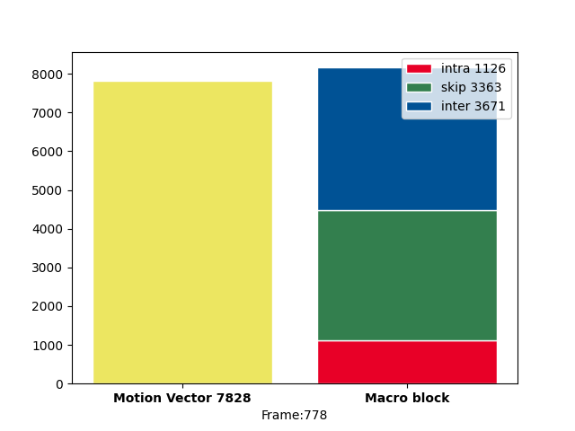
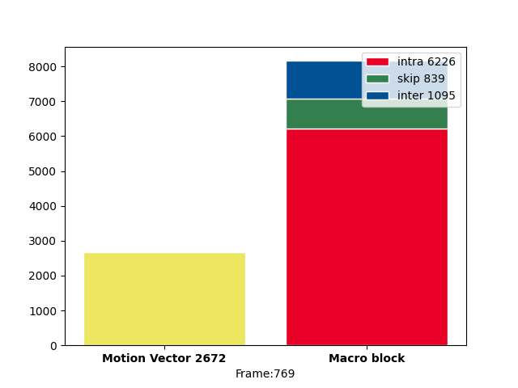
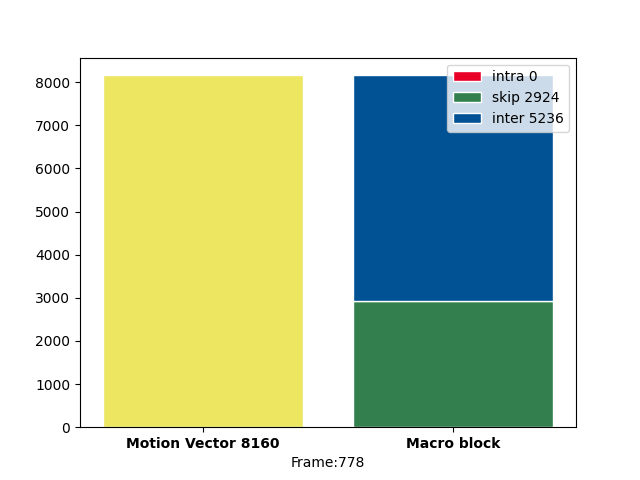
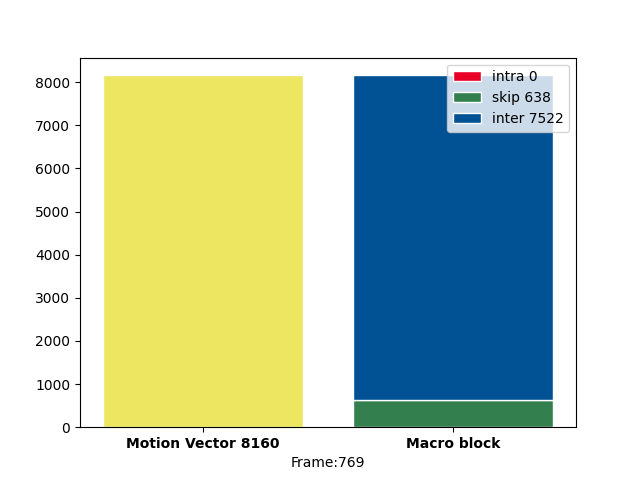

# MV-get-realtime

## File Description

### extract_mvs.c
Extracts and passes the motion vectors (MV) data for each individual decoding of a frame as numpy array to the module `py_emb.py` in the format of `[frame number, source, width, height, x0, y0, x1, y1]`. It also passes the quantities of MV inside each frame to `stdout`, and computes the max and min value.

Compile: `Makefile`

Usage: `./extract_mvs <input video>`

### py_emb.py
Embedded module in `extract.c`. Receives numpy array about MV data (frame-by-frame) for further application.

### mpegutils.c
Dumps macroblock (MB) type data to `stderr`.

Compile: copy and replace the file to `ffmpeg/libavcodec`, then re-build ffmpeg.

Usage: `ffmpeg -debug mb_type -i <input video> -thread_type none <output video>`

### analyse.c
Compute costs for each possible MB type (SKIP, INTRA, INTER), then decide the best type to encode. The file has been fine-tuned such that the output video will not have INTRA MB in its P-slice, and all MB size = 16x16. For further detail, refer to the [**Generate missing MVs**](#Generate-missing-MVs) section.

Compile: copy and replace the file to `x264/encoder`, then re-build libx264 and ffmpeg.

Usage: use ffmpeg to compress a video file with H.264 codec. 
e.g. `ffmpeg -i <input.mp4> -c:v libx264 -bf 0 <output.mp4>`


### plotframeinfo.py
Plots stacked bar chart of MV and MB for a given frame.

Usage: `python3 plotframeinfo.py <MV data> <MB data> <frame number>`

### mvs.txt
Contains MV data as:
```
frame number, MV quantity
```

### mbdata.txt
Contains MB type data in the format of:
```
##FRAME## INTRA=quantity, SKIP=quantity, INTER=quantity, B16=quantity, BX=quantity
```
Where `B16` refers to MB size of 16x16, and `BX` is any other size. Line number indicates frame number.

## Generate missing MVs
In order to generate full and consistent number of MVs for each frame, one has to disable INTRA MB type as well as forcing all MB into the same size, in this case, 16x16. It will leave the whole frame being left with only INTER and SKIP type MB of size 16x16. These requirements are achieved by modifying `analyse.c` from `x264/encoder`. Under the function `void x264_macroblock_analyse( x264_t *h )`.

The below results (Fig.1 ~ Fig.4) demonstrate the generation of missing MVs using the tools mentioned in [**File Description**](#File-Description) section. 

### Before fine-tuning

\
*__Figure 1.__ Frame with most MVs*

\
*__Figure 2.__ Frame with least MVs*


### After fine-tuning

\
*__Figure 3.__ Frame with previously most MVs*

\
*__Figure 4.__ Frame with previously least MVs*

## MB type index

| index | ffmpeg char | condition                    | remark                                              |
|-------|-------------|------------------------------|-----------------------------------------------------|
| 0     | P           | IS_PCM                       | Lossless (raw samples without prediction)           |
| 1     | A           | IS_INTRA && IS_ACPRED        | 16x16 Intra prediction                              |
| 2     | i           | IS_INTRA4x4                  | 4x4 Intra prediction                                |
| 3     | I           | IS_INTRA16x16                |                                                     |
| 4     | d           | IS_DIRECT && IS_SKIP         |                                                     |
| 5     | D           | IS_DIRECT                    | No motion vectors are sent (B slices)               |
| 6     | g           | IS_GMC && IS_SKIP            | 16x16 Skip macroblock (P or B slices)               |
| 7     | G           | IS_GMC                       | Global motion compensation (not relevant for H.264) |
| 8     | S           | IS_SKIP                      |                                                     |
| 9     | >           | !USES_LIST(1)                | Reference to past (List 0, P or B slices)           |
| 10    | <           | !USES_LIST(0)                | Reference to future (List 1, B slices)              |
| 11    | X           | USES_LIST(0) && USES_LIST(1) | Reference to past and future (List 1 & 2, B slices) |

## How to compile

### ffmpeg
```shell
cd ffmpeg
```
```shell
PATH="$HOME/bin:$PATH" PKG_CONFIG_PATH="$HOME/ffmpeg_build/lib/pkgconfig" ./configure \
  --prefix="$HOME/ffmpeg_build" \
  --pkg-config-flags="--static" \
  --extra-cflags="-I$HOME/ffmpeg_build/include" \
  --extra-ldflags="-L$HOME/ffmpeg_build/lib" \
  --extra-libs="-lpthread -lm" \
  --bindir="$HOME/bin" \
  --enable-gpl \
  --enable-libx264 \
  --enable-static \
  --enable-shared && \
PATH="$HOME/bin:$PATH" sudo make -j 4 && \
sudo make install -j 4 && \
hash -r
```

### x264
```shell
cd x264
```
```shell
PATH="$HOME/bin:$PATH" PKG_CONFIG_PATH="$HOME/ffmpeg_build/lib/pkgconfig" ./configure --prefix="$HOME/ffmpeg_build" --bindir="$HOME/bin" --enable-static --enable-pic && PATH="$HOME/bin:$PATH" make -j 4 && \
make install -j 4
```

## Troubleshoot
[ffmpeg: error while loading shared libraries](https://stackoverflow.com/questions/12901706/ffmpeg-error-in-linux) 

